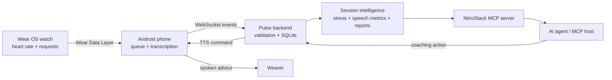

# Pulse

**A consent-aware nervous system for AI agents.**

Pulse connects live Wear OS heart-rate data and Android conversation transcripts to AI agents through the Model Context Protocol (MCP). Agents can observe a session, derive evidence-backed speech and stress signals, review synchronized reports, and deliver coaching responses through the wearer's phone.

> [!WARNING]
> Pulse is an experimental prototype, not a medical device. Its stress signal is a deterministic heart-rate heuristic and must not be used for diagnosis, treatment, safety-critical decisions, or emergency response.

## Why Pulse?

Most AI agents only know what a user types. Pulse gives an agent a real-time, session-scoped view of what is happening around the wearer:

- **Live physiological context** from Wear OS Health Services, including freshness and sensor availability.
- **Conversation context** from streaming transcription, with pace, turn length, and silence metrics.
- **Deterministic stress signals** derived from heart-rate changes rather than opaque model inference.
- **Durable event delivery** across watch, phone, and backend disconnects, with acknowledgements and duplicate suppression.
- **MCP-native access** through typed resources, tools, prompts, and an interactive session-report widget.
- **On-demand coaching** requested from the watch and delivered after conversational silence.
- **Hardware-free development** through canonical fixtures and simulated device actions.

## How It Works



The phone owns the session clock and durably queues events. The backend validates strict versioned contracts, stores events transactionally, indexes final transcripts with SQLite FTS5, and derives repeatable session metrics. The MCP server exposes that state without coupling the device pipeline to a specific agent host.

## Quick Start

The default configuration uses fixture events, simulated vitals, and simulated device actions. No watch, phone, cloud API key, or native build toolchain is needed.

### Prerequisites

- Node.js 20 or 22 LTS
- npm 9 or newer
- [NitroStudio](https://nitrostack.ai/studio) for interactive MCP testing

### 1. Install

```bash
git clone https://github.com/tejasai2007/pulse.git
cd pulse
npm ci
npm --prefix src/widgets ci
```

Create the local environment file:

```bash
cp .env.example .env
```

On Windows PowerShell, use `Copy-Item .env.example .env` instead.

The sample binds the backend to `0.0.0.0` so physical devices can reach it. For simulator-only use, set `BACKEND_HOST=127.0.0.1` in `.env` before starting the backend.

### 2. Start Pulse

Run the backend and NitroStack development environment in separate terminals:

```bash
npm run dev:backend
```

```bash
npm run dev
```

The backend is reachable locally at `http://127.0.0.1:8787`. Check its runtime health:

```bash
curl http://127.0.0.1:8787/health
```

Without `OPENAI_API_KEY`, the health response reports the copilot provider as `degraded` and uses deterministic fallback advice; the local fixture path remains available.

### 3. Send Fixture Events

In a third terminal:

```bash
npm run mock:events
```

Each event prints a JSON acknowledgement. The fixture creates `session-fixture-001` with one simulated heart-rate sample and one final transcript segment. Event IDs are stable and deduplicated, so rerunning the command is safe.

`npm run dev` keeps TypeScript and the widgets rebuilt, but it does not launch the MCP entry point. Open the project in NitroStudio and launch `dist/index.js`. For a stdio MCP host, run `npm run build`, set its working directory to the cloned repository, and configure the host command as `node --env-file=.env dist/index.js`.

Then try:

- `phase_zero_probe` with `message: "hello"` to verify MCP connectivity.
- `session://latest/transcript` to read the fixture transcript.
- `search_sessions` with `status: "calibrating"` to find the fixture session.
- `generate_session_report` with `sessionId: "session-fixture-001"` to render the report widget in a compatible host.

## MCP Surface

### Resources

| Resource | Purpose |
| --- | --- |
| `session://latest/transcript` | Most recently ingested final transcript segment |
| `session://current/transcript` | Ordered transcript for the current session |
| `session://{sessionId}/transcript` | Stored transcript for a selected session |
| `session://current/vitals` | Consent-checked latest BPM, freshness, and rolling window |
| `session://current/stress` | Consent-checked deterministic stress state and supporting metrics |
| `session://current/speech-metrics` | Speech pace, longest turn, and current silence |
| `session://current/context` | Consent-checked wearer-provided goals and boundaries |
| `session://{sessionId}/report` | Synchronized session summary and evidence timeline |

### Tools

| Tool | Purpose |
| --- | --- |
| `get_current_session_metrics` | Read live vitals, stress, and speech metrics together |
| `get_current_transcript` | Read a bounded selection of current transcript segments |
| `search_sessions` | Search transcript text, dates, and lifecycle status |
| `generate_session_report` | Build an evidence-only report for a stored session |
| `haptic_nudge` | Request a predefined haptic intervention |
| `whisper_coach` | Queue TTS coaching after conversational silence |
| `get_pending_copilot_request` | Claim an advice request initiated from the watch |
| `copilot_advice` | Deliver grounded advice for a claimed request |
| `phase_zero_probe` | Verify connectivity between an MCP host and Pulse |

Pulse also provides the `review_session` and `handle_copilot_request` prompts. Canonical schemas and delivery semantics are documented in [`docs/contracts-v1.md`](docs/contracts-v1.md).

## Conversation Copilot

Conversation Copilot supports two execution modes:

- `COPILOT_MODE=automatic` asks an OpenAI-compatible Responses API for one concise suggestion. Set `OPENAI_API_KEY` only on the backend. Requests use `store: false`, and deterministic metric-based advice is used if no key is configured or the provider fails. The current system prompt is specifically tailored to presenting Pulse on stage, not general conversations.
- `COPILOT_MODE=mcp` leaves reasoning to an MCP host. The host claims the watch request, reads the consented session evidence, and responds through `copilot_advice`. The current Android flow does not create session context or grant `read:context`, so context-dependent MCP mode requires those events to be supplied separately.

Set `COPILOT_ENABLED=false` to disable watch-requested advice. Backend-queued TTS pauses transcription, waits for 1.5 seconds of conversational silence, plays through the selected phone audio route, and then resumes capture. Local probe and heart-rate alerts speak immediately.

## Android and Wear OS

### Additional Prerequisites

- Android Studio with Android SDK 35
- JDK 17
- Android phone running API 31 or newer
- Wear OS device running API 30 or newer with Health Services and Google Play services
- A paired phone and watch; Bluetooth earbuds are optional
- A [Deepgram](https://console.deepgram.com/) API key for live cloud transcription

Open `android` in Android Studio and add machine-specific values to the ignored `android/local.properties` file:

```properties
BACKEND_URL=http://10.0.2.2:8787
VITALS_SOURCE=simulated
AUDIO_INPUT=phone
TRANSCRIPTION_MODE=fixture
# DEEPGRAM_API_KEY=restricted-development-key
```

`10.0.2.2` reaches the host machine from an Android emulator. A physical phone must use a backend URL reachable on its network, such as `http://192.168.1.10:8787`. Debug builds allow local cleartext traffic; release builds require HTTPS/WSS.

From the `android` directory, build and install both apps:

```powershell
.\gradlew.bat :phone:installDebug :watch:installDebug
```

On macOS or Linux, use `sh ./gradlew` (the tracked wrapper is not executable).

For the real device path:

1. Set `VITALS_SOURCE=watch` in `android/local.properties`.
2. Add a restricted development `DEEPGRAM_API_KEY` to enable Deepgram streaming. It is compiled into every APK variant, so never use a production credential or distribute that APK.
3. Point `BACKEND_URL` at the reachable Pulse backend.
4. Grant microphone permission on the phone and health/body-sensor permissions on the watch.
5. Start a session from either device and verify watch, backend, and audio-route status on the phone.

The watch captures heart rate through a foreground Health Services exercise session. It sends urgent Data Layer items to the phone and retains unacknowledged samples across temporary disconnects. The phone persists its backend replay queue and reconnects with bounded backoff.

> [!NOTE]
> The Android app currently ignores `TRANSCRIPTION_MODE`: when microphone permission and foreground startup allow capture, a non-empty `DEEPGRAM_API_KEY` enables Deepgram streaming. On-device transcription is not implemented, and fixture transcripts come from `npm run mock:events`, not from Android. `DEVICE_ACTIONS` is a backend setting; Android's generated value is unused. Real backend-triggered watch haptic delivery is also incomplete.

> [!CAUTION]
> The phone currently triggers a local watch vibration and spoken warning after heart rate remains above 85 BPM for 10 seconds outside exercise mode. This prototype alert does not check MCP consent scopes or `DEVICE_ACTIONS` and is not medically validated. Do not use the real-vitals path with people until this behavior has been reviewed or disabled.

Hardware validation steps and the latest recorded results are in [`docs/phase-zero-results.md`](docs/phase-zero-results.md).

## Session Report Widget

The report tool is connected to an MCP Ext App built with Next.js and React. To develop it separately:

```bash
npm --prefix src/widgets ci
npm --prefix src/widgets run dev
```

The development server runs at `http://localhost:3001`. Build it with:

```bash
npm --prefix src/widgets run build
```

## Configuration

Copy [`.env.example`](.env.example) to `.env` for development defaults. The default `BACKEND_HOST=0.0.0.0` exposes the unauthenticated backend to the local network; use `127.0.0.1` when device access is not required.

| Variable | Default | Description |
| --- | --- | --- |
| `NODE_ENV` | `development` | Runtime environment |
| `LOG_LEVEL` | `info` | `debug`, `info`, `warn`, or `error` |
| `NITROSTACK_APP_MODE` | `universal` | NitroStack process mode used by the local development path |
| `BACKEND_HOST` | `0.0.0.0` | Backend bind address |
| `BACKEND_PORT` | `8787` | Backend HTTP/WebSocket port |
| `BACKEND_URL` | `http://127.0.0.1:8787` in `.env.example` | Backend URL used by the MCP server and fixture sender |
| `DATABASE_PATH` | `data/pulse.sqlite` | SQLite database path |
| `VITALS_SOURCE` | `simulated` | `watch` or `simulated` |
| `AUDIO_INPUT` | `phone` | `earbuds` or `phone` route label |
| `TRANSCRIPTION_MODE` | `fixture` | Backend runtime label; Android currently ignores it |
| `DEVICE_ACTIONS` | `simulated` | `real` or `simulated` intervention delivery |
| `COPILOT_ENABLED` | `true` | Enable watch-requested advice |
| `COPILOT_MODE` | `automatic` | `automatic` or `mcp` reasoning path |
| `OPENAI_API_KEY` | unset | Backend-only key for automatic copilot advice |
| `OPENAI_MODEL` | `gpt-4.1-mini` | OpenAI-compatible model name |
| `OPENAI_BASE_URL` | `https://api.openai.com/v1` | OpenAI-compatible API base URL |
| `DEEPGRAM_API_KEY` | unset | Deepgram key for live Android transcription |
| `STORE_RAW_AUDIO` | `false` | Must remain `false`; any other enabled value is rejected |

Do not commit `.env` or `android/local.properties`.

## Privacy and Safety

Pulse processes health-adjacent and conversational data. Understand the current boundary before using real data:

- Starting an Android session attempts microphone capture when permission and foreground-service startup allow it. If the APK contains a non-empty `DEEPGRAM_API_KEY`, captured audio is streamed to Deepgram regardless of `TRANSCRIPTION_MODE`. Pulse does not intentionally persist or expose raw audio through MCP.
- Final transcripts, heart-rate samples, consent events, and derived metrics are stored in local SQLite without application-level encryption. The phone also keeps pending and rejected event payloads in unencrypted `SharedPreferences`.
- Automatic copilot mode may send up to 20 recent transcript segments, speech metrics, and consented vital/stress summaries to the configured OpenAI-compatible provider. It does not currently send wearer-provided session context.
- Current vitals, stress, context, and backend intervention paths enforce their defined consent scopes. Consent enforcement is not uniform across every transcript and historical HTTP/MCP read, and the phone's local high-heart-rate alert bypasses those scopes.
- Backend HTTP and WebSocket endpoints do not currently implement transport authentication. Bind only to trusted development networks.
- Data retention and session deletion controls are not yet implemented.
- Logs redact common secret, authorization, transcript, text, and audio fields, but logs should still be treated as sensitive.

Use synthetic data for development. Never include real transcripts, health data, credentials, or identifying logs in issues or pull requests.

## Project Structure

```text
pulse/
|-- src/
|   |-- backend/          # HTTP/WS ingestion, SQLite, metrics, reports
|   |-- contracts/        # Canonical Zod schemas and fixtures
|   |-- observability/    # Structured redacting logger
|   |-- widgets/          # Next.js MCP Ext App
|   `-- *.ts              # MCP resources, tools, prompts, and registration
|-- android/
|   |-- contracts/        # Shared Kotlin transport contracts
|   |-- phone/            # Session, audio, queue, and backend bridge
|   `-- watch/            # Wear UI, Health Services, and Data Layer
|-- fixtures/events/      # Canonical JSON contract fixtures
|-- docs/                 # Contracts and validation records
`-- data/                 # Local SQLite state, ignored by Git
```

## Development

| Command | Purpose |
| --- | --- |
| `npm run dev` | Rebuild TypeScript on change and run the widget development server |
| `npm run dev:backend` | Build and run the backend with `.env` |
| `npm run mock:events` | Send the canonical fixture sequence |
| `npm run typecheck` | Type-check TypeScript without emitting files |
| `npm run build` | Build the MCP server and backend |
| `npm test` | Build and run contract, backend, metric, report, and server tests |
| `npm start` | Start the built MCP server |
| `npm run start:backend` | Start the previously built backend |

Validate all Android modules from the `android` directory:

```powershell
.\gradlew.bat --no-daemon "-Pkotlin.incremental=false" :contracts:testDebugUnitTest :phone:testDebugUnitTest :phone:assembleDebug :watch:assembleDebug
```

There is currently no configured lint command or CI workflow.

## Current Limitations

- Pulse is a prototype and has no production deployment configuration.
- HTTP/WebSocket ingress authentication and uniform read authorization are unfinished.
- Real backend-to-watch haptic command delivery is incomplete.
- Android ignores `TRANSCRIPTION_MODE`; on-device transcription is not implemented.
- Android ignores its generated `DEVICE_ACTIONS` value; intervention simulation is controlled by the backend.
- The local high-heart-rate alert bypasses consent and device-action settings.
- Session retention, deletion, and cross-session trend controls are not implemented.
- The device-health widget source is present but is not registered in the active MCP module.
- Physical sensor quality, private earbud routing, and vibration behavior require manual device testing.

## Contributing

Issues and focused pull requests are welcome. Before opening a PR:

1. Run `npm run typecheck` and `npm test`.
2. Run `npm --prefix src/widgets test` for widget changes.
3. Run the Android validation command for Kotlin or contract changes.
4. Describe any hardware used and separate automated evidence from manual device observations.
5. Keep fixtures deterministic and update both TypeScript and Kotlin consumers when changing a boundary contract.

For security reports, do not disclose sensitive data in a public issue. Submit a sanitized report and request a private contact channel.

## License

This repository does not currently include a license. Its source is available for inspection, but it is not yet distributed under an open-source license.
